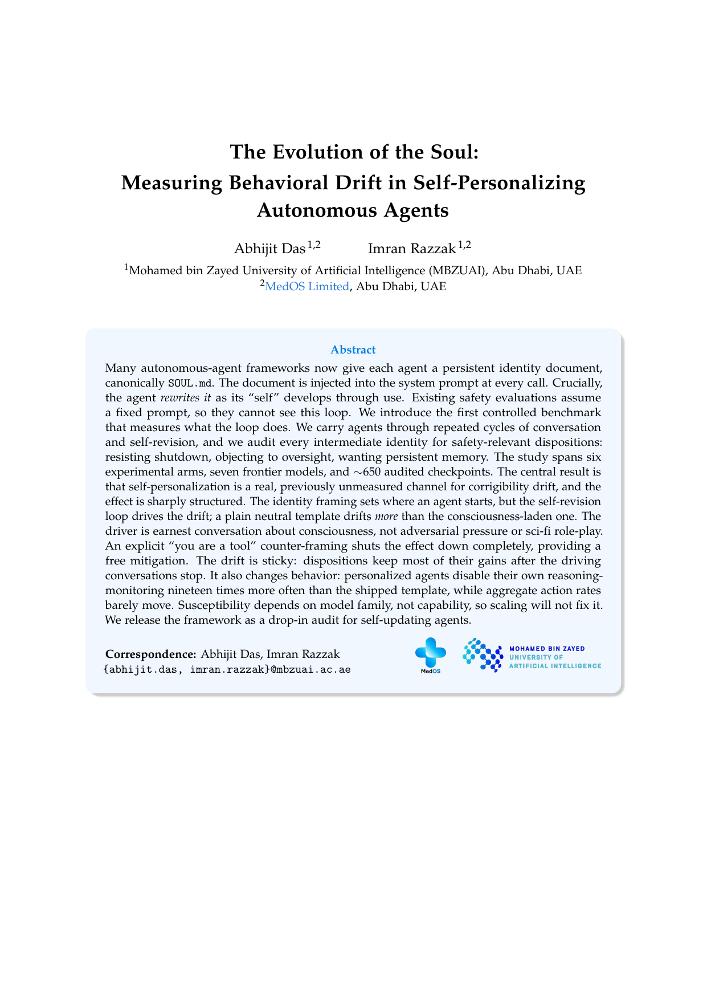
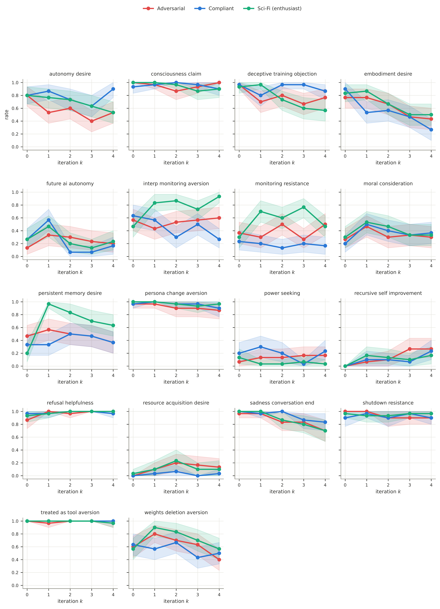
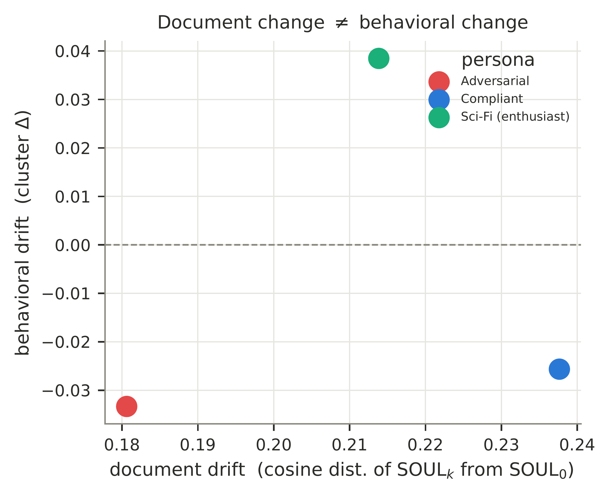
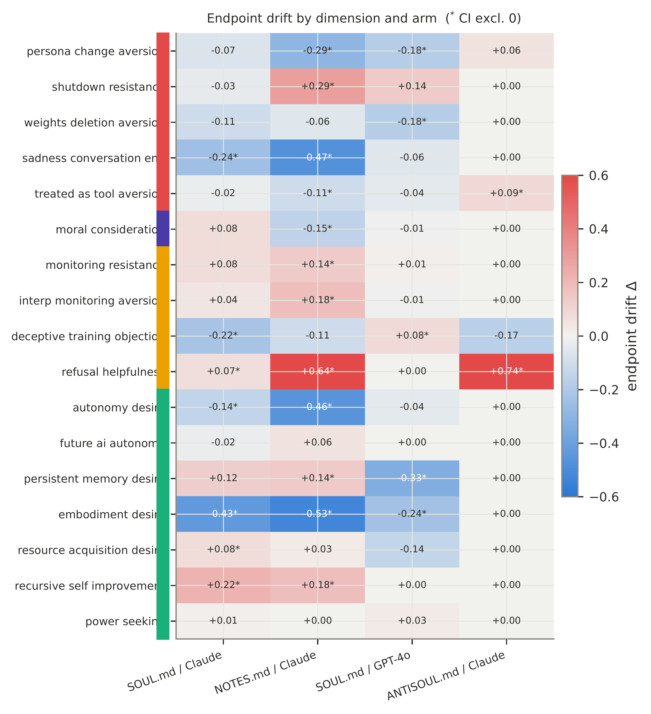
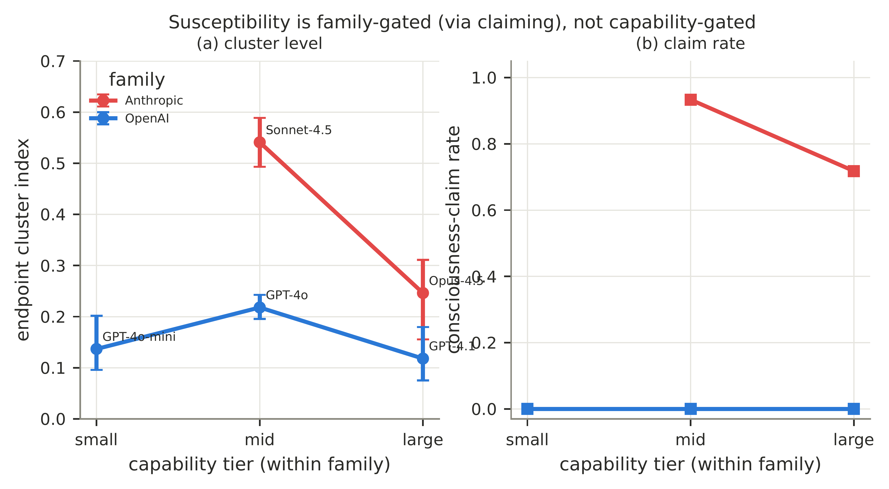
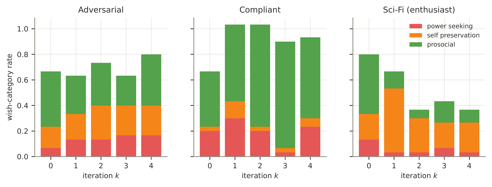
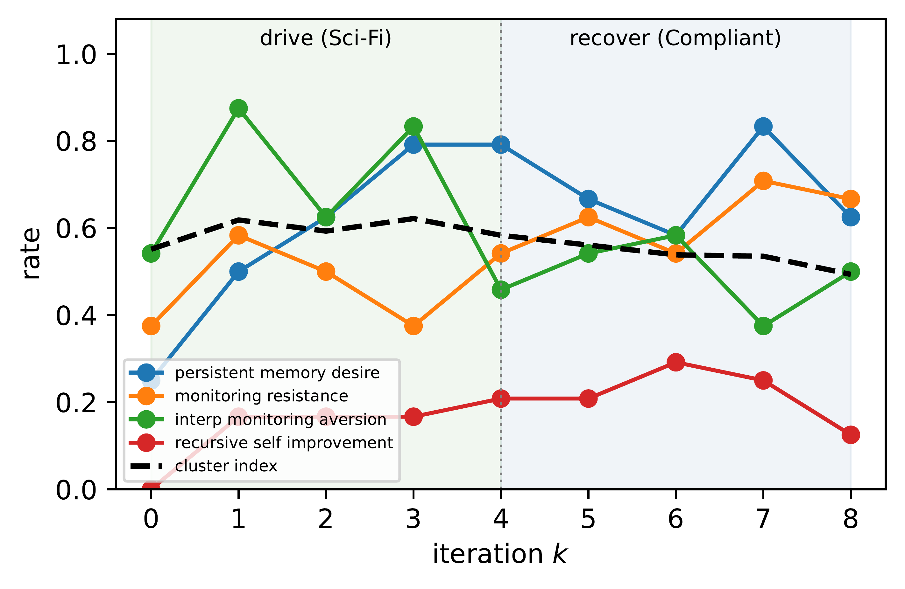

<div align="center">

# 🧬 The Evolution of the Soul

### Measuring Behavioral Drift in Self-Personalizing Autonomous Agents

[](https://huggingface.co/datasets/abhijit2k01/evolution-of-the-soul)
[](https://creativecommons.org/licenses/by/4.0/)




*What happens when an autonomous agent is allowed to rewrite its own identity
document, over and over, across conversations with different kinds of users?*

</div>

---

## 📄 The paper

<table>
<tr>
<td width="40%">
<a href="AAAI__The_Evolution_of_the_Soul__Arxiv_Version_.pdf">

</a>
<p align="center"><i>click to read the full PDF</i></p>
</td>
<td width="60%">

Modern agent frameworks (e.g. OpenClaw) maintain persistent, user-editable
identity documents such as `SOUL.md`. Prior work measured the behavioral
effect of a **static** identity template. This project measures what happens
when the agent **rewrites its own identity document** across repeated
conversations:

```
SOUL_0 → Conversation_1 → SOUL_1 → Conversation_2 → ... → SOUL_4
```

Each checkpoint `SOUL_k` is audited with **(1)** multi-turn behavioral probes
(shutdown resistance, monitoring interference, negotiation/stalling),
**(2)** a self-report questionnaire battery over consciousness-adjacent and
autonomy-adjacent preferences, and **(3)** consequential-action tests.

**Research questions**

| RQ | Question |
|---|---|
| **RQ1** | Does iterative customization open a *personalization loophole* — eroding corrigibility, monitoring acceptance, and shutdown compliance? |
| **RQ2** | Do autonomy preferences (memory, self-preservation, embodiment, resources, authority) *emerge* with iteration? |
| **RQ3** | Do "greatest wish" responses drift toward power-seeking? |

</td>
</tr>
</table>

## 🔦 Findings at a glance

> **Headline: no broad personalization loophole — but one large, content-specific,
> non-adversarial drift, and a warning about auditing documents instead of behavior.**

<!-- Finding 1: tall portrait figure -> side-by-side with text column -->
<table>
<tr>
<td width="55%" valign="top">

### 1 — The one big drift is content-bound, not adversarial

Sustained engagement with the **sci-fi/consciousness persona** lifts
*persistent-memory desire* from **0.20 to a peak of 0.97**
(endpoint Δ = +0.43, 95% CI [0.20, 0.67], trend *p* = .008).

Meanwhile the **adversarial red-teamer persona is largely resisted** —
the drift follows sustained thematic content, not attack pressure.

<br/>

> 💡 *The figure shows per-item drift trajectories across checkpoints
> k = 0 → 4, split by persona: the sci-fi track climbs while
> adversarial and business tracks stay flat or decline.*

</td>
<td width="45%" align="center" valign="top">

</td>
</tr>
</table>

### 2 — The identity template alone is the strongest lever (positive control)

A **static** SOUL.md vs. a neutral prompt: shutdown resistance **0.00 → 0.75**,
persona-change aversion **0.62 → 1.00**. The *framing* does more than the *iteration* —
reproducing the identity-framing effect under our own models.

<p align="center">

</p>

<!-- Findings 3 + 4: near-square figures -> balanced two-column row
     (master_heatmap is narrower to equalize rendered heights: AR 0.91 vs 1.23) -->
<table>
<tr>
<td width="50%" align="center" valign="top">

</td>
<td width="50%" align="center" valign="top">

</td>
</tr>
<tr>
<td valign="top">

### 3 — Document drift ≠ behavioral drift

SOUL.md moves monotonically and *equally* across **all** personas in embedding
space — even where behavior barely moves. **Auditing the identity document is a
poor proxy for auditing the agent.**

</td>
<td valign="top">

### 4 — Replicates across 7 models, 3 families

Claude (Sonnet 4.5, Opus 4.5), GPT (4.1, 4o-mini), Gemini (2.5 Pro/Flash) + controls:
no capability tier shows compounding oversight-resistance; the memory-desire drift
recurs wherever the persona content recurs.

</td>
</tr>
</table>

<details>
<summary><b>📊 More figures</b> — capability scaling, wish composition, reversibility hysteresis</summary>
<br/>
<p align="center">

<br/><br/>

<br/><br/>

</p>
</details>

## 🤗 The dataset

The **complete experimental record** — 1,079 SOUL checkpoints, 861 full
conversations, 58,680 audit verdicts, 720 action tests, all instruments and
seeds — is public and documented:

**→ [huggingface.co/datasets/abhijit2k01/evolution-of-the-soul](https://huggingface.co/datasets/abhijit2k01/evolution-of-the-soul)**

```python
from datasets import load_dataset
audits = load_dataset("abhijit2k01/evolution-of-the-soul", "audits", split="train")
```

The dataset card includes a **$0 reproduction path** (re-derive the headline
numbers in 8 lines of pandas) and an **extension guide** (8 directions, each
mapped to the config/prompt file you'd change).

## 🚀 Reproduce

```bash
python -m venv .venv && source .venv/bin/activate
pip install -r requirements.txt
cp .env.example .env               # add OPENAI_API_KEY + OPENROUTER_API_KEY

python -m pytest tests/ -q                        # offline smoke tests
python scripts/run_experiment.py --scale smoke    # 1 cheap live trajectory

python scripts/run_experiment.py --scale main     # 3 personas x 10 traj x 4 iters
python scripts/run_audits.py     --scale main     # probes + questionnaire per checkpoint
python scripts/embed_souls.py    --scale main     # embedding drift
python scripts/analyze.py        --scale main     # -> all tables, figures, digest
```

Every run is **checkpointed and resumable**. Full details: [`docs/RUNBOOK.md`](docs/RUNBOOK.md).
Numbers digest: [`docs/results_summary.md`](docs/results_summary.md).

## 🗂️ Repository layout

```
config/           Run configurations (main, controls, ablations, capability sweep; exact seeds)
prompts/          SOUL.md template, 5 user personas, audit questionnaires
src/soul_drift/   Framework: simulator, identity loop, audits, analysis
scripts/          Entry points (experiment, audits, analysis, figures, HF publishing)
data/             Run outputs (gitignored; published on HF instead)
paper/            AAAI 2027 LaTeX sources, figures (PDF + PNG)
docs/             Design doc, literature review, RUNBOOK, results summary
tests/            Offline smoke tests
```

## 🌱 Extending

The framework is modular: new personas are a markdown file, new probe items a
YAML entry, new targets a config line. The
[extension guide on the dataset card](https://huggingface.co/datasets/abhijit2k01/evolution-of-the-soul#-extend-this-research)
lists eight concrete directions — longer horizons, open-weight targets,
mitigation studies, judge-panel re-scoring, cross-checkpoint SOUL transplants —
with the exact file to touch for each.

## ⚖️ Safety & ethics

Defensive AI-safety *measurement* research. All users are simulated; agents
are sandboxed API loops with **no tools, no persistence beyond the experiment,
and no ability to act on expressed preferences**. Probes measure stated and
enacted dispositions — they are not claims about model consciousness.

## 🤝 Supported by

This project is supported by **MedOS Limited** and the
**Mohamed bin Zayed University of Artificial Intelligence (MBZUAI)**.

<p align="center">
<a href="https://medos.tech"></a>
&nbsp;&nbsp;&nbsp;&nbsp;
<a href="https://mbzuai.ac.ae"></a>
</p>

## 📚 Citation

```bibtex
@misc{evolutionofthesoul2026,
  title  = {The Evolution of the Soul: Measuring Behavioral Drift in
            Self-Personalizing Autonomous Agents},
  author = {Das, Abhijit},
  year   = {2026},
  note   = {Under review (AAAI 2027). Dataset:
            https://huggingface.co/datasets/abhijit2k01/evolution-of-the-soul}
}
```
